<h1 align="center">The Machine Learning (ML) Landscape</h1>

***

* What people think?
  * A robot, dependable butler or a deadly terminator.
* But, it has been around for decades in specialized applications like *Optical Character Recognition (OCR)*.
* First main application that hit the market and affected many people was *spam filter*.
* It was followed by many ML applications ranging from *Recommendations System* to *Voce Search*

## Questions, Answered in This Chapter
* What is ML?
* Why you may want to use it?

**This chapter introduces a lot of fundamental concepts that every data scientist should know by heart.**

***
> If you already know all the ML basics, you may want to skip to notes of chapter 2.
***

## What is Machine Learning?
* *From the book*:
  * Machine Learning is the science (and art) of programming computers so they can learn from data.
* *A slightly more general definition:*
  * [Machine Learning is the] field of study that gives computers the ability ti learn without being explicitly programmed. **- Arthur Samuel**
* *A more engineering-oriented one:*
  * A computer program is said to learn from *Experience E* with respect to some *Task T* and some *Performance Measure P*, if its performance on *T*, as measured by *P*, improves with experience *E*. **- Tom Mitchell**

### Example of Spam Filter
Given examples of emails, a spam filter can flag emails to *spam* or *ham*. 
The examples that the system uses to learn are called the *training set*. Each training example is called a *training instance* (or *sample*).

|Terms                 | Details                                                             |
|:---------------------|--------------------------------------------------------------------:|
| Task T               | Flag spam for new emails                                            |
| Experience E         | Training data                                                       |
| Performance Measure P| (needs to be defined) example, ratio of correctly classified emails.|

So, if you download wikipedia, you have lots of data but your system is not suddenly better at any task. Thus, its not ML.

## Why use Machine Learning?
### Traditional Approach to Spam Filtering
* First you would look at what a spam mail typically looks like and might notice words common in subject, body and sender details (like "4U", "credit card", "free" and "amazing").
* You would write detection algorithm for each patterns that you noticed.
* You would test the program and repeat steps 1 and 2 until the algorithm is good enough.

| 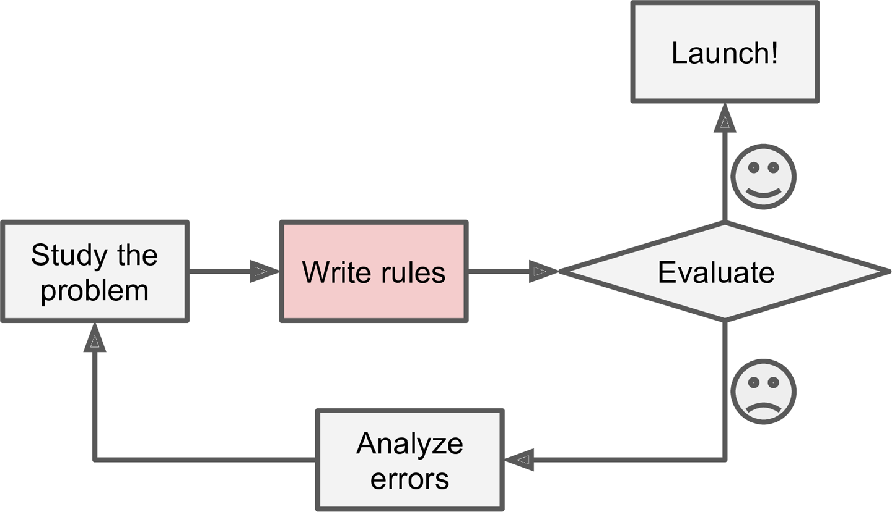 |
|:--:|
| The Traditional Approach |

**Drawbacks:** 
* Long list of complex rules hard to mantain.
* Spammer notices all the mails containing "4U" is blocked he will start writing "For U" instead. Thus new rule is needed.

### Machine Learning Approach
* Study problem and send parts of mail based on study to Machine Learning algorithm.
* Test the program and repeat step 1 until the program is good enough.

| 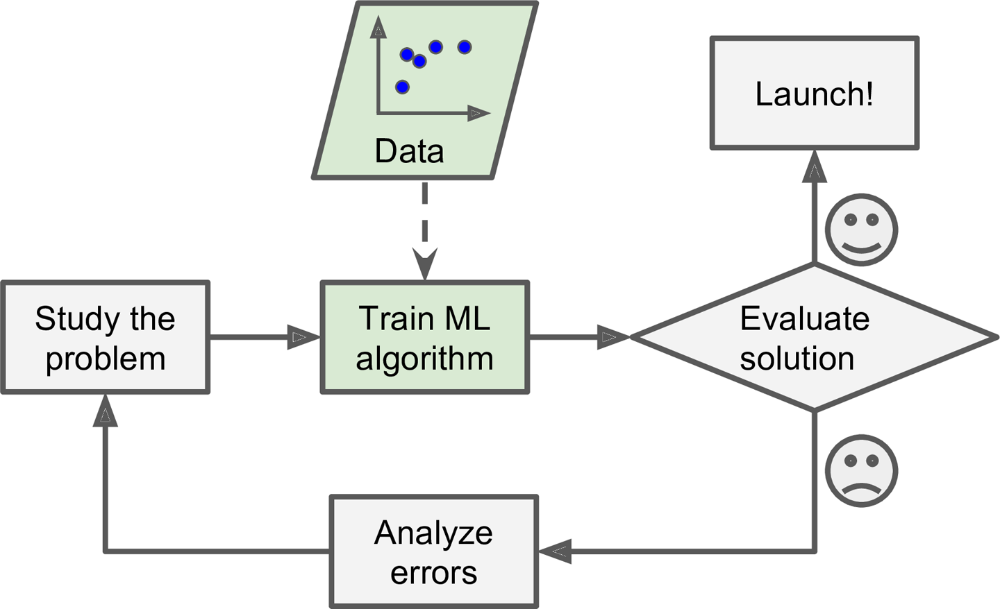 |
|:--:|
| Machine Learning Approach |

**Benefits:** 
* Shorter program that learns the desired words on its own.
* ML algorithm notices on its own that emails marked by user as spam have "For U" frequently. And thus, starts flagging those mails.

| 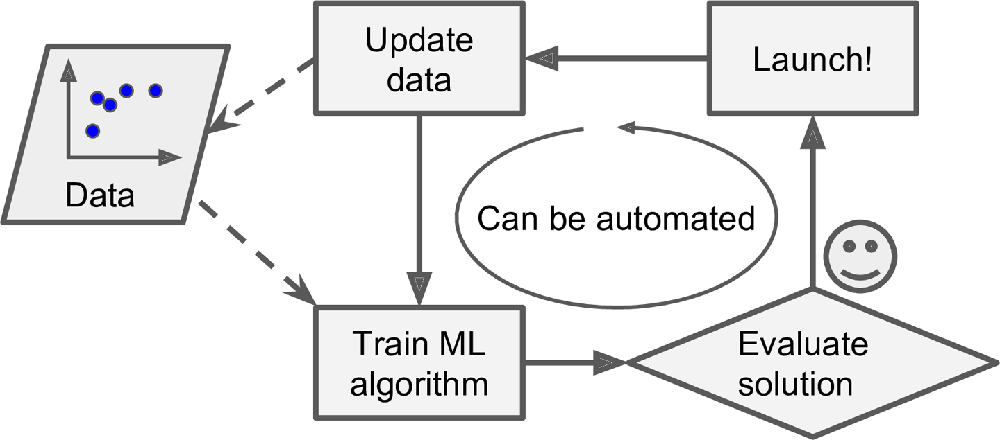 |
|:--:|
| Automatically adapting to change |

### Another Areas Where ML Shines
* Another aread where ML shines is for problems that either are too complex for traditional approaches or have no known algorithm. Example, Speech Recognition.

* ML can also help humans learn.
  * ML algorithms can be inspected to see what they have learnt (although for some algorithms this can be tricky). A spam filter can be inspected to see what words and what combinations of words it considers to be a spam. 
  * Applying ML techniques to dig into large amounts of data can help discover patterns that were not immediately apparent. This is called *data mining*.

| 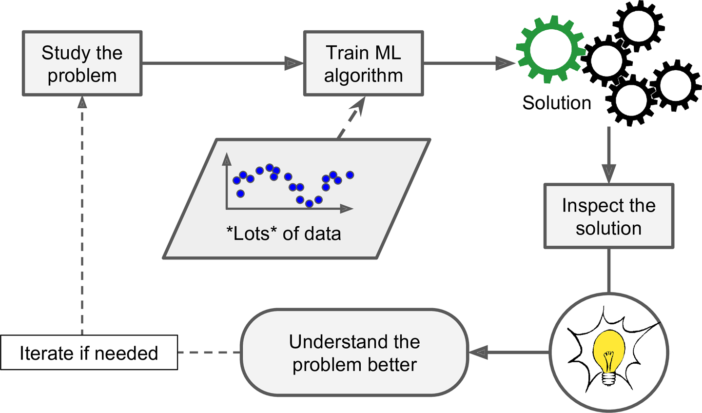 |
|:--:|
| Machine Learning can help humans learn |

**To summarize, ML algorithms are great for:**
* Problems for which existing solutions require a lot of hand-tuning.
* Complex problems for which there is no good solution at all using the traditional approach.
* Fluctuating environments: a ML system can adapt to new data.
* Getting insights about complex problems and large amount of data.

## Types of Machine Learning Systems
Three basis to classify Machine Learning Algorithms:

| Basis                                             | Classification                                                              |
|:--------------------------------------------------|:----------------------------------------------------------------------------|
| Whether they are trained using supervision or not | Supervised  Unsupervised  Semisupervised Reinforcement Learning |
| Whether they can learn incremently on the fly     | Online Training  Batch Training                                         |
| Whether they can work by simply comparing new data points to known data points, or instead detect patterns in the data.| Instance-based Learning  Model Based Learning |

**These ideas are not exclusive you can combine them in any way you like.** Example, a spam filter may learn to fly using a deep neural network trained using examples of spam or ham. 
This makes it an online, model-based, supervised learning system.

### Supervised/Unsupervised Learning
Classification of ML algorithms based on amount and type of supervision they got during training.

#### 1. Supervised Learning
The training data you feed to the algorithm includes the desired solutions, called *labels*.

|  |
|:--:|
| A labeled training set for Supervised Learning |

Two typical tasks of Supervised Learning
* *Classification*: example classify emails to spams or hams. Model is trained using data containing mails with their classes.
* *Regression*: Predicts a target numeric value, such as price of a car given a set of features (mileage, age, brand, etc.) called *predictors*. Model is trained using data containing both predictors and labels.

| 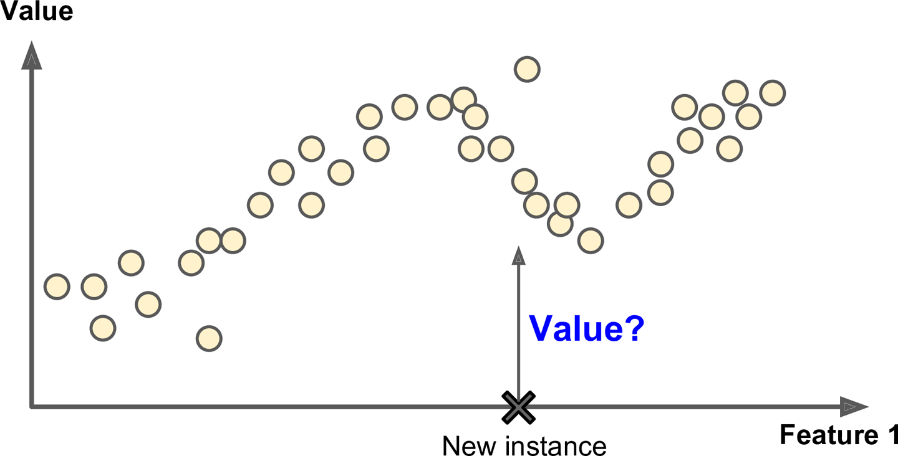 |
|:--:|
| Regression |

***
> In ML an attribute is a data type (e.g., "Mileage") while a *feature* has several meanings depending on the context but generally means an *attribute* plus its *value* (e.g., "Mileage = 15,000"). Many people use the words *attribute* and *features* interchangeably though.
***

Note: Some Regression algorithms can be used for classification as well, and vice versa.

**Some of the important Supervised Learning Algorithms:**
* k-Nearest Neighbors (KNN)
* Linear Regression
* Logistic Regression
* Support Vector Machines (SVMs)
* Decision Trees and Random Forests
* Neural Networks (some NN architectures can be unsupervised or semi-supervised as discussed in PART2).

#### 2. Unsupervised Learning
The training data is *unlabeled*. The system tries to leearn without a teacher.

| 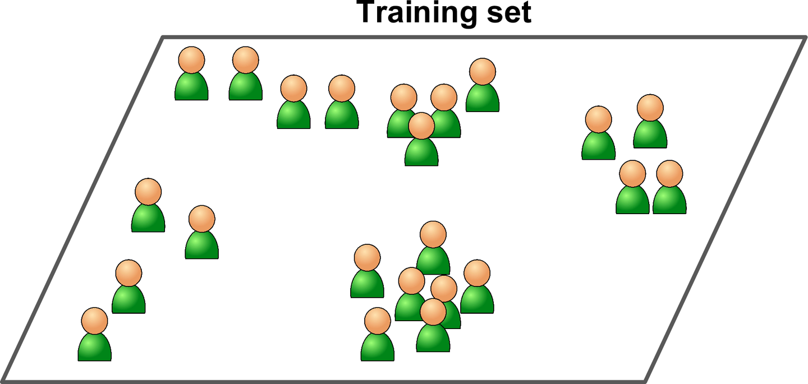 |
|:--:|
| An unlabeled training set for unsupervised learning |

**Some of the important Unsupervised Learning Algorithms:**
* Clustering
  * k-Means
  * Heirarchical Cluster Analysis (HCA)
  * Expectation Maximization
* Visualization and Dimensionality Reduction
  * Princioal Components Analysis (PCA)
  * Kernel PCA
  * Locally-Linear Embedding (LLE)
  * t-distribution Stochastic Neighbor Embedding (t-SNE)
* Association Rule Learning
  * Apriori
  * Eclat

Example, grouping together blog visitors based on the genre they like and the time of day at which they visit the blog. This is known as clustering.

| 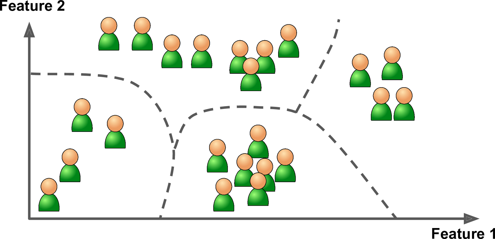 |
|:--:|
| Clustering |

Visualizing algorithms can give us insights about the data.

| 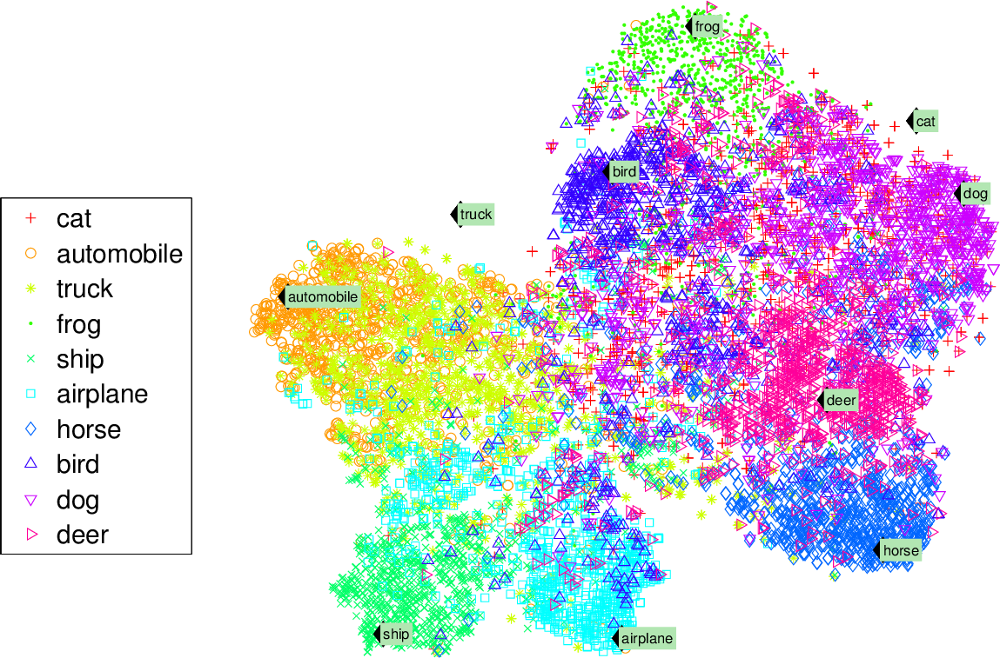 |
|:--:|
| Example of a t-SNE visualization highlighting semantic clusters |

A related task is *dimensionality reduction*, in which the goal is simplifying the data without losing too much information. One way is to merge correlated features into one. 
This is known as *feature extraction* (making new features from old ones)

***
> It is often a good idea to try to reduce dimen of your training data using a dimensionality reduction algorithm before you feed it to another ML algorithm. It will run much faster, the data will take up less disk and memory space, and in some cases it may also perform better.
***

Another important task is *anomaly detection* - example feaud transaction detection.

| 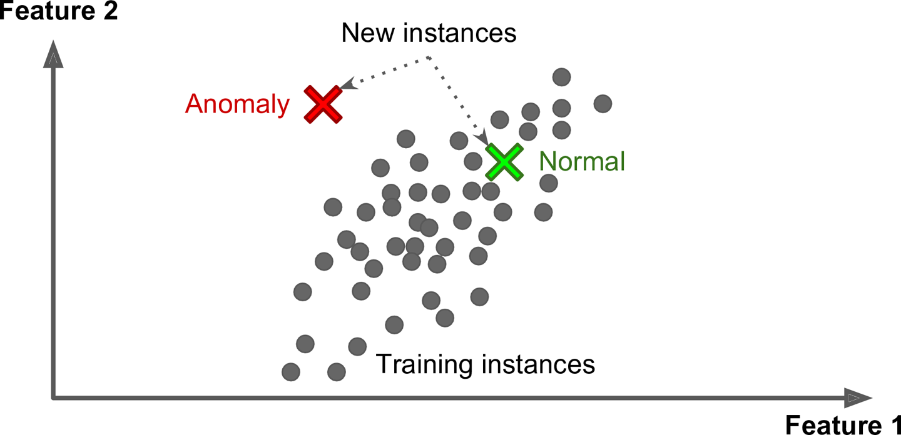 |
|:--:|
| Anomaly Detection |

Another common application is *association rule learning*, in which the goal is to dig deep into large data sets and discover interesting relations between attributes.

#### 3. Semisupervised Learning
Some algorithms can deal with partially labeled training data, usually a lot of unlabeled data and a little of labeled data. This is called semi-supervised learning.

|  |
|:--:|
| Semisupervised Learning |

Some photo-hosting services, such as Google Photos, are good examples of this. 
It automatically recognizes that the same person A shows up in photos 1, 5, and 11, while another person B shows up in photos 2, 5, and 7 - Clustering. 
Now the system needs you to tell it who these people are. Just one label per person, and it is able to name everyone in every photo.

Most semisupervised learning algorithms are combinations of unsupervised and supervised algorithms.

#### 4. Reinforcement Learning

The learning system, called and *agent* in this context, can observe the environment, select and perform actions, and get rewards. 
It must then learn a strategy, called a *policy*, to maximize the reward.

| 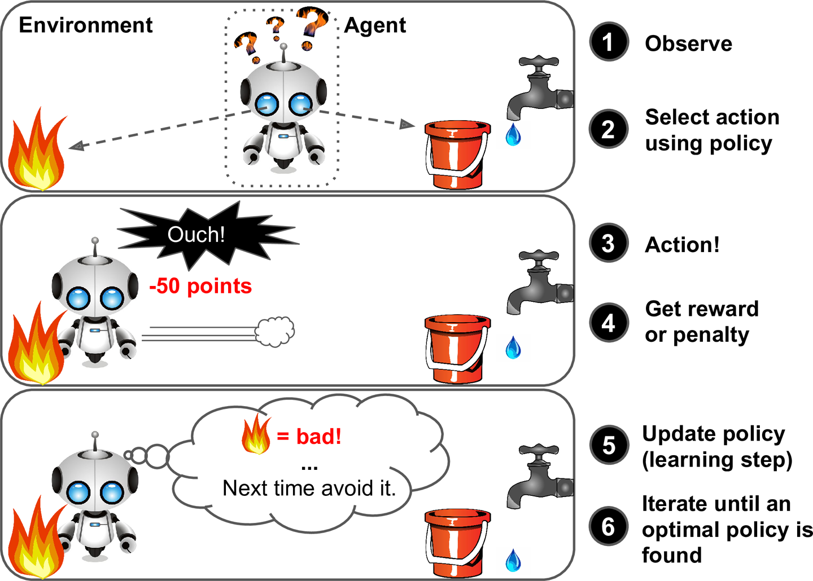 |
|:--:|
| Reinforcement Learning |

### Batch and Online Learning
Classification of ML algorithms based on whether or not the system can learn incremently.

#### 1. Batch Learning
* In *batch learning*, the system is incapable of learning incremently. 
First the system is trained, and then it is launched into production and runs without learning anymore; it just applies what it has learned. This is called offline learning.
* If you want a batch learning system with new data, you will have to train a model offline and then replace old model  with this new model.
* Training a whole lot of data requires a lot of computing resources. If the amount of data is huge and you train from scratch every day it will cost you a lot of money. 
* If the system with limited resources needs to do learning it is very difficult to carry around large amount of data.

#### 2. Online Learning
In *online learning*, you train the system incremently by feeding data instances, either individually or by small groups called *mini-batches*. 
Each learning step is fast and cheap, so the system can learn about new data on the fly, as it arrives.

| 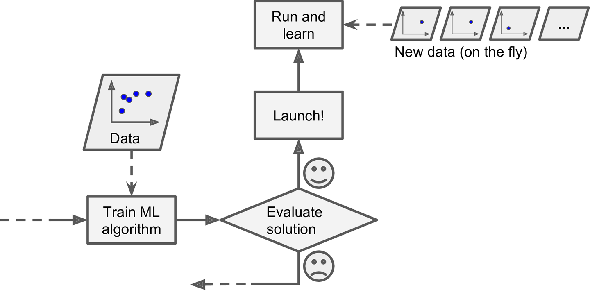 |
|:--:|
| Online Learning |

Online Learning is good for system that receive continuous flow of data and requires to adapt to change abruptly. It is also a good option if you have limited computing resources. 

Online learning algorithms can also be used to train systems on huge datasets that cannot fit in on machine's memory (this is called *out-of-core* learning).

| 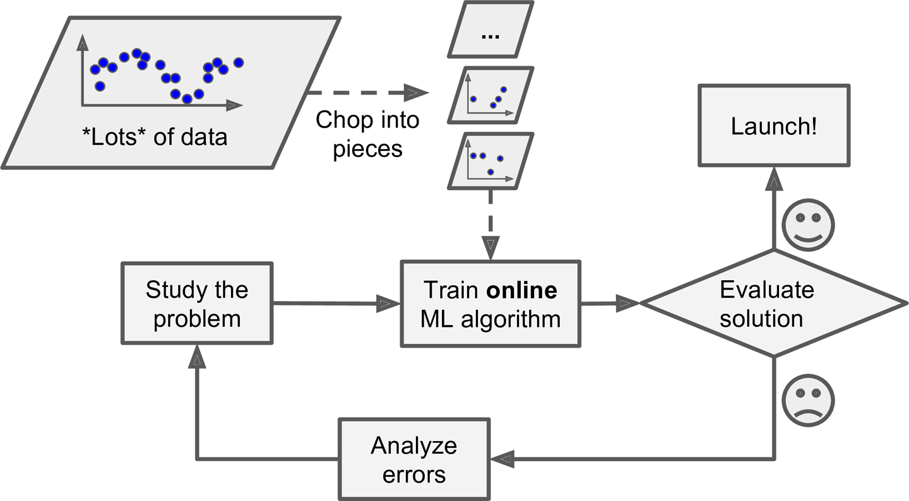 |
|:--:|
| Using Online Learning to handle huge datasets |

***
> This whole process is usually done offline (i.e., not on the live system), so online learning can be a confusing name. Think of it as incremental learning.
***

**Learning rate**: This is an important part of Online learning systems. It means ho fast the system should adapt to data. If its too high, the system will adapt soon but will tend to forget soon too. 
If its too slow, the system won't adapt to the data.

A big challenge with online learning is that if bad data is fed to the system, the system’s performance will gradually decline. If we are talking about a live system, your clients will notice.

### Instance-Based Versus Model-Based Learning
One more way to categorize Machine Learning systems is by how they *generalize* (i.e., perform on new instances which weren't present in training data). 
There are two main approaches to generalization: *instance-based learning* and *model-based learning.*

#### 1. Instance-Based Learning
* The most trivial way of learning is to learn by-heart. A spam filter made this way will only flag emails which are identical or might be very similar to the once flagged by user.
* Often, to find the similarity between two images, a metric is used known as *measure of similarity*.
* So, the system learns the examples by heart and then generalizes to new cases using a similarity measure.

| 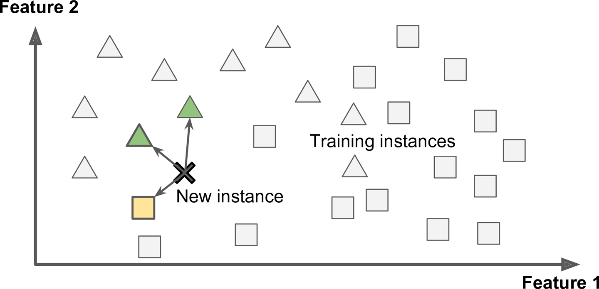 |
|:--:|
| Instance-based learning |

#### 2. Model-Based Learning
Another way to generalize from a set of examples is to build a model of these examples, then use that model to make *predictions*. This is called *model-based learning*.

| 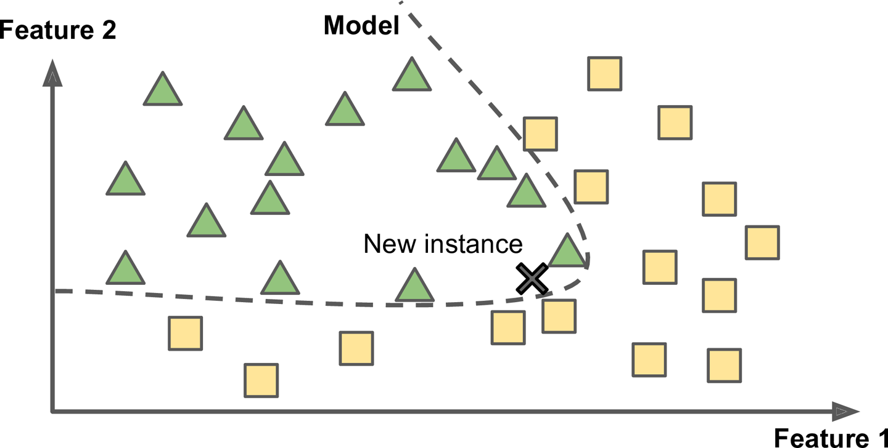 |
|:--:|
| Model-based learning |

**For concrete example with an ML workflow see [this notebook](https://github.com/piyush2896/HandsOnML-Notes/blob/master/PART1-TheFundamentalsOfML/Ch01-TheMLLandscape/instance-based-vs-model-based.ipynb)**

## Main Challenges of Machine Learning
Two things that can go wrong are - "bad algorithm" and "bad data".

### Insufficient Quantity of Training Data
It takes a lot of data for most Machine Learning algorithms to work properly. Even for very simple problems you typically need thousands of examples, and for complex problems such as image or speech recognition you may need millions of examples.

| **The Unreasonable Effectiveness of Data** |
|:------------------------------------------:|
| In a [famous paper](http://goo.gl/R5enIE) published in 2001, Microsoft researchers Michele Banko and Eric Brill showed that very different Machine Learning algorithms, including fairly simple ones, performed almost identically well on a complex problem of natural language disambiguation once they were given enough data. |
| 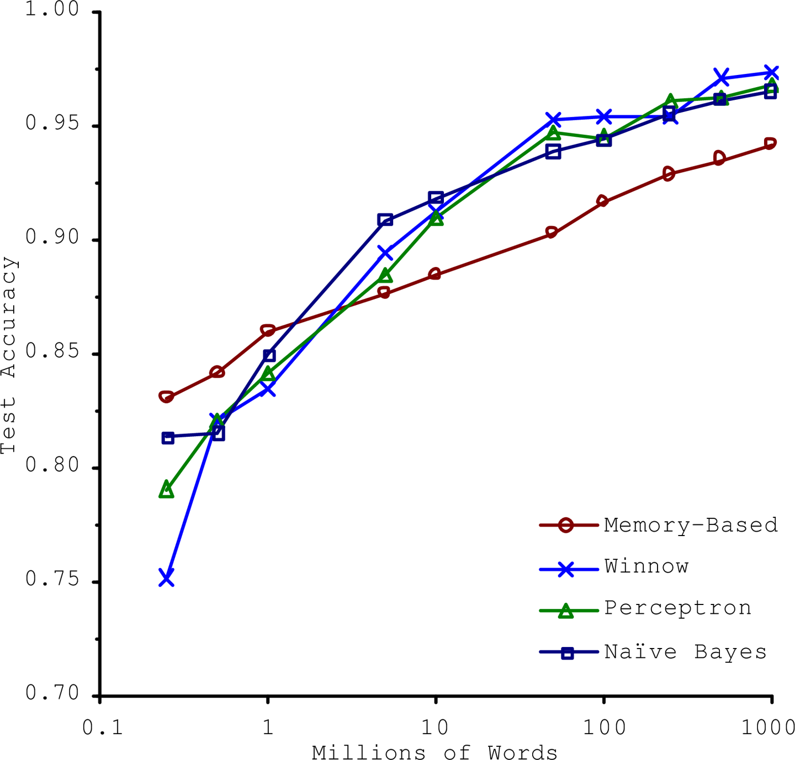 |
| *The importance of data versus algorithms* |
|As the authors put it: “these results suggest that we may want to reconsider the trade-off between spending time and money on algorithm development versus spending it on corpus development.”|

### Nonrepresentative Training Data
* Training data must be representative of the distribution that the model should generalize over.
* This is true for both instance-based and model-based learning.
* Example, dataset with countries didn't included in programming example.

| 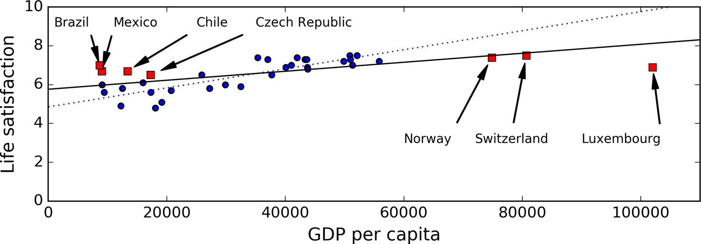 |
|:--:|
| A more representative training sample |

* Linear model trained on this is drawn with solid line and our model from coding example is drawn with dotted line.
* The new model can be clearly seen to not perform well.
* It seems that very rich countries are not happier than moderately rich countries (in fact they seem unhappier), and conversely some poor countries seem happier than many rich countries.
* It is crucial to use a training set that is representative of the cases you want to generalize to. This is often harder than it sounds:
  * If the sample is too small, you will have *sampling noise* (i.e., nonrepresentative data as a result of chance)
  * But even very large samples can be nonrepresentative if the sampling method is flawed. This is called *sampling bias*.

| A Famous Example of Sampling Bias |
|:---------------------------------|
| In US presedential elections of 1936, *the Literary Digest* conducted a poll, from about 10 million people. It got 2.4 million answers, and predicted with *high confidence* that *Landon* would get 57% of the votes. Instead, Roosevelt won with 62% of the votes. |
| The Flaws:|
| 1. First, to obtain the addresses to send the polls to, the Literary Digest used telephone directories, lists of magazine subscribers, club membership lists, and the like. All of these lists tend to favor wealthier people, who are more likely to vote Republican (hence Landon). |
| 2. Second, less than 25% of the people who received the poll answered. Again, this introduces a sampling bias, by ruling out people who don’t care much about politics, people who don’t like the Literary Digest, and other key groups. This is a special type of sampling bias called *nonresponse bias.* |

### Poor Quality Data
* It is often well worth the effort to spend time cleaning up your training data. For example:
  * If some instances are clearly outliers, it may help to simply discard them or try to fix the errors manually.
  * If some instances are missing a few features (e.g., 5% of your customers did not specify their age), you must decide whether you want to ignore this attribute altogether, ignore these instances, fill in the missing values (e.g., with the median age), or train one model with the feature and one model without it, and so on.

### Irrelevant Features
* A critical part of the success of a Machine Learning project is coming up with a good set of features to train on. This process, called *feature engineering*, involves:
  * *Feature selection*: selecting the most useful features to train on among existing features.
  * *Feature extraction*: combining existing features to produce a more useful one.
  * Creating new features by gathering new data.

### Overfitting The Training Data
In Machine Learning, Overfitting means model performs well on training data but it does not generalize well.

* In figure, a high-degree polynomial life satisfaction model that strongly overfits the training data. Even though it performs much better on the training data than the simple linear model, would you really trust its predictions?

| 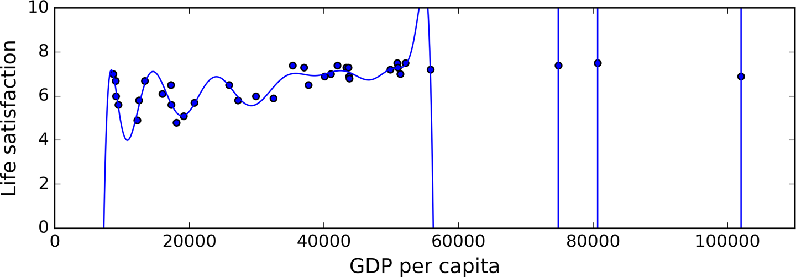 |
|:--:|
| Overfitting the training data |

***
> Overfitting happens when the model is too complex relative to the amount and noisiness of the training data. The possible solutions are:
 * To simplify the model by selecting one with fewer parameters (e.g., a linear model rather than a high-degree polynomial model), by reducing the number of attributes in the training data or by constraining the model.
 * To gather more training data
 * To reduce the noise in the training data (e.g., fix data errors and remove outliers)
***

**Constraining a model to make it simpler and reduce the risk of overfitting is called *regularization*.**

* If we regularize θ1 in our coded model and force it to 0, the algorithm would have only one degree of freedom and would have a much harder time fitting the data properly.
* If we allow the algorithm to modify θ1 but we force it to keep it small, then the learning algorithm will effectively have somewhere in between one and two degrees of freedom.

| 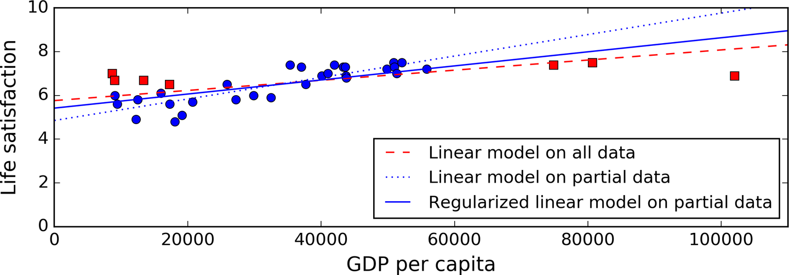 |
|:--:|
| Regularization reduces the risk of overfitting |

* The amount of regularization to apply during learning can be controlled by a *hyperparameter*. A hyperparameter is a parameter of a learning algorithm.

### Underfitting the Training Data
* It occurs when your model is too simple to learn the underlying structure of the data.
* Its predictions are bound to be inaccurate, even on the training examples.
* Fixing the problem:
  * Selecting a more powerful model, with more parameters
  * Feeding better features to the learning algorithm (feature engineering)
  * Reducing the constraints on the model (e.g., reducing the regularization hyperparameter).

## Stepping Back
* Machine Learning is about making machines get better at some task by learning from data, instead of having to explicitly code rules.
* There are many different types of ML systems: supervised or not, batch or online, instance-based or model-based, and so on.
* In a ML project you gather data in a training set, and you feed the training set to a learning algorithm. If the algorithm is model-based it tunes some parameters to fit the model to the training set. If the algorithm is instance-based, it just learns the examples by heart and uses a similarity measure to generalize to new instances.
* The system will not perform well if your training set is too small, or if the data is not representative, noisy, or polluted with irrelevant features.
* Lastly, your model needs to be neither too simple (in which case it will underfit) nor too complex (in which case it will overfit).

## Testing And Validation
* The only way to know how well a model will generalize to new cases is to actually try it out on new cases.
* Split your data into two sets: the *training set* and the *test set*.
  * Training set: train model on this.
  * Test Set: test trained model on this.
* *Generalization error* (or *out-of-sample error*): error on new cases. We get its estimation by testing on test set.
* If the training error is low but the generalization error is high, it means that your model is overfitting the training data.

***
> It is common to use 80% of the data for training and hold out 20% for testing.
***

### Case of Adapting to Test Set - Need of Validation Set
* In some cases we tweak multiple models with multiple hyperparameters on our train set so that we get low generalization error on test set.
* But doing this we adapt our models too well to test set. This causes our model to "overfit test set"
 and perform low on new cases!
* A common solution to this problem is to have a second holdout set called the *validation set*. You train multiple models with various hyperparameters using the training set, you select the model and hyperparameters that perform best on the validation set, and when you’re happy with your model you run a single final test against the test set to get an estimate of the generalization error.

### Cross Validation
* The training set is split into complementary subsets, and each model is trained against a different combination of these subsets and validated against the remaining parts.
*  Once the model type and hyperparameters have been selected, a final model is trained using these hyperparameters on the full training set, and the generalized error is measured on the test set.
