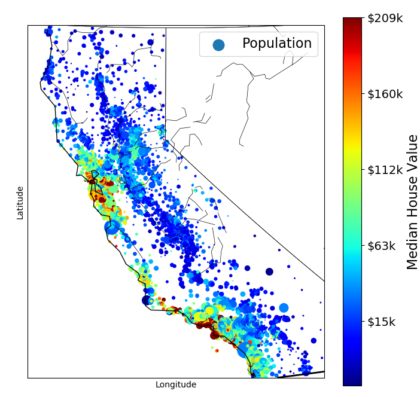
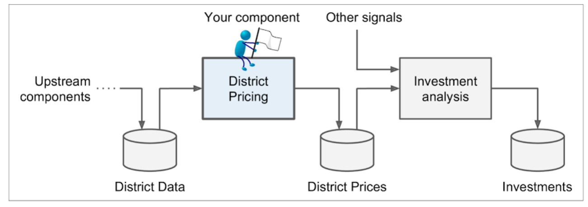

<h1 align="center">End-to-End Machine Learning Project</h1>

***

Let's pretend to be a recently hired data scientist in a real estate company.

## The Main Steps to Follow
* Look at the big picture.
* Get the data.
* Discover and visualize the data to gain insights.
* Prepare the data for Machine Learning algorithms.
* Select a model to train it.
* Fine-tune your model.
* Present your solution.
* Launch, Monitor, and mantain your system.

## Working With Real Data
It is best to experiment with real worl data when learning about ML. Here are a few places you can look to get data:

* Popular open-data repositories:
  * [UC Irvine Machine Learning Repository](https://archive.ics.uci.edu/ml/)
  * [Kaggle datasets](https://www.kaggle.com/datasets)
  * [Amazon's AWS datasets](https://registry.opendata.aws/)
* Meta portals (they list open data repositories)
  * [http://dataportals.org](http://dataportals.org)
  * [http://opendatamonitor.eu](http://opendatamonitor.eu/)
  * [http://quandl.com](http://quandl.com)
* Other pages listing many popular open data repositories:
  * [Wikipedia's list of Machine Learning datasets](https://en.wikipedia.org/wiki/List_of_datasets_for_machine_learning_research)
  * [Quora.com question](https://www.quora.com/Where-can-I-find-large-datasets-open-to-the-public)
  * [Datasets subreddit](https://www.reddit.com/r/datasets)

### What We will be Using?
In this chapter we chose the [California Housing Prices dataset](https://www.dcc.fc.up.pt/~ltorgo/Regression/cal_housing.html). It contains dataset from 1990 California Census.

|  |
|:----------------------------------------------:|
| *California Housing prices* |

Visualization script - [visualize_pop.py](./visualize_pop.py)

## Look at the Big Picture
First task - build a model of housing prices in California using California census data. This data has metrics:

|Metrics         |Property  |
|:--------------:|:--------:|
|longitude       |continuous|
|latitude        |continuous|
|housingMedianAge|continuous| 
|totalRooms      |continuous| 
|totalBedrooms   |continuous| 
|population      |continuous|
|households      |continuous| 
|medianIncome    |continuous|
|medianHouseValue|continuous|

These metrics represent values for each block group in california. Block groups are the smallest geographical unit for which the US Census Board publishes sample data. We will call the "districts" for short.

**Given all other metrics, model should be able to predict the median housing price in any district.**

***
>First thing you do is to pull out your Machine Learning project checklist.
***

## Frame the Problem
### First Question
* The **first question to ask**: What exactly is the business objective? How does the company expect to use and benefit from this model?
* This is important because it will determine:
  * how you frame the priblem
  * what algorithms you will select
  * what performance measure you will use to evaluate your model, and
  * how much effort you should spend tweaking it.

* **Answer**:
  * The model's output (prediction of price in a block) will be fed to another ML system along with many signals.
  * This system will predict whether it is worth investing in this block.

|  |
|:-------------------------------------------------:|
| *A Machine Learning Pipeline for Real Estate Investments* |

***
<h3 align="center">PIPELINES</h3>
* A sequence of data processing componenets is called a data *pipeline*.
* They are very common in ML systems due to large amount of data and many data transformation requirements.
* Components typically run [asynchronously](https://en.wikipedia.org/wiki/Asynchronous_system).
* Each component:
  * Pulls a large amount of data
  * Process it
  * Spits out the result in  another data store for another component
* The interface between components is simple the data store. So different teams can focus on different components.
* The architecture is robust - if a component fails, the component downstream can keep using the previous output of the failed component.
* Thus, without proper monitoring a broken component can go unnoticed. The data gets stals and the overall performance drops.
***

### Second Question
* The **second question to ask**: what the current solution looks like (if any).
* It gives you a reference performance, as well as insights on how to solve the problem.

**Answer**:
  * An expert team gathers information about distric and estimate price using complex rules.
  * This is costly and time-consuming. They often realize that their estimates were off by more than 10%.

### Finally! Framing the Problem
* It is clearly a **supervised learning task** - given all the other params predict the label, median house price.
* It is a **regression task** - prediction is a real value number.
* It is **multivariate regression problem** - using multiple features to predict
* There is no continuous flow of data coming in the system, there is no particular need to adjust to changing data rapidly, and the data is small to fit in the memory, so plain **batch learning** should do just fine.

***
> If the data was huge, you could either split your batch learning work across multiple servers, or you could use an online learning technique instead.
***

## Select Performance Measure
A typical performance measure for regression problems is the Root Mean Squared Error (RMSE).

This equation introduces several common ML notations. See <a href="./ML_NOTATIONS.md" traget='_blank'>here</a>.

In some context we may choose a different performance measure function. For example, suppose there are many outlier districts, then *Mean Aboslute Error (MAE)* might be considered as a better choice.

For other possibilities of distance functions (or performance functions) check the <a href="./ML_NOTATIONS.md" traget='_blank'>notations markdown</a>.

## Check the Assumptions
* List and verify assumptions made so far.
* This can catch serious issues early on.
* Example, If the downstream ML system, before using the predicted price, converts it to three categories - "cheap", "medium" and "expensive". Then we don't need our system to predict price perfectly. We just need category right. Then this becomes a classification task.

## Let's Dirty Our Hands!!
This section is divided into two steps one in another markdown and the last in a jupyter notebook.
* [Creating the workspace](./workspace_creation.md)
* [End-to-End Project](./Housing.ipynb)

***
> [End-to-End Project](./Housing.ipynb) contains **more notes**, with simple code from book.

> [Creating the workspace Markdown](./workspace_creation.md) and [Notations markdown](./ML_NOTATIONS.md) are separate as they can be referred to again and again, and are linked in the root README.md.
***
